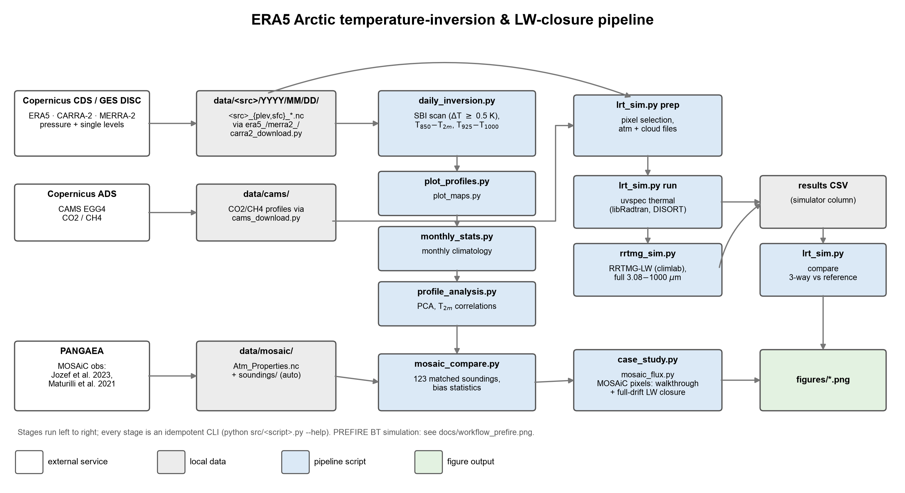
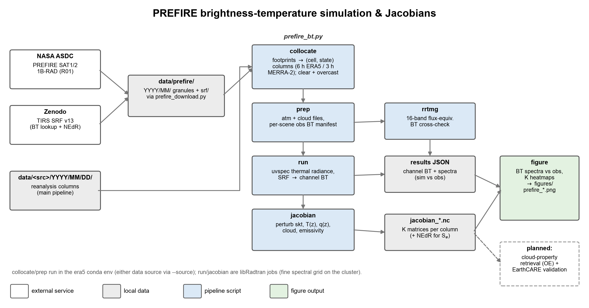

# Arctic Temperature-Inversion Pipeline (ERA5 / MERRA-2 / CARRA-2)

Automated pipeline that downloads reanalysis data over the Arctic (80–90°N by
default) from **ERA5** (Copernicus CDS), **MERRA-2** (NASA GES DISC) or
**CARRA-2** (Copernicus CDS, 2.5 km regional),
computes temperature-inversion strength with three metrics, aggregates
monthly climatologies, analyzes profile variability (PCA) and
surface-temperature relationships, validates against MOSAiC radiosondes, and
simulates clear-sky broadband LW fluxes with libRadtran for comparison with
ERA5 radiation — with AGU-style figures at every stage.

The data source is selected with `source:` in `config.yaml` or `--source
{era5,merra2,carra2}` on any analysis stage (see "Data sources" below).
All three sources run stages 1-8 (incl. the stage-7 LW closure, the RRTMG
cross-check and the PREFIRE BT simulation); stage 7c (the hourly state-time
test) is ERA5-only. CARRA-2 publishes no ozone, so its radiative-transfer
stages splice the afglsw subarctic-winter climatology, and its reference
fluxes come from the forecast stream (1-h windows; see the CARRA-2 stage-7
notes).

## Workflow at a glance



Regenerate with `python src/workflow_chart.py`.

## Repository layout

```
era5_analysis/
├── config.yaml                  # user-editable defaults (source, area, variables, SBI params, paths)
├── environment.yml              # conda env "era5"
├── src/
│   ├── era5_download.py         # stage 1 (ERA5): CDS downloads (parallel, idempotent)
│   ├── merra2_download.py       # stage 1 (MERRA-2): GES DISC OPeNDAP subsets
│   ├── carra2_download.py       # stage 1 (CARRA-2): CDS pan-Arctic subsets
│   ├── daily_inversion.py       # stage 2: daily inversion metrics
│   ├── plot_profiles.py         # stage 3a: profile illustration figures
│   ├── plot_maps.py             # stage 3b: polar snapshot maps
│   ├── monthly_stats.py         # stage 4: monthly statistics + figures
│   ├── profile_analysis.py      # stage 5: profile PCA, surface-T, correlations
│   ├── mosaic_compare.py        # stage 6: reanalysis vs MOSAiC radiosondes
│   ├── mosaic_profiles.py       # stage 6b: per-level T/q/RH vs MOSAiC, all sources
│   ├── cams_download.py         # CAMS EGG4 CO2/CH4 profiles (for stage 7)
│   ├── lrt_sim.py               # stage 7: libRadtran LW fluxes vs reanalysis (er3t_env!)
│   ├── rrtmg_sim.py             # stage 7b: RRTMG-LW cross-check via climlab (era5 env)
│   ├── statetime_test.py        # stage 7c: snapshot vs accumulation-window test
│   ├── case_study.py            # MOSAiC clear/cloudy single-pixel walkthrough figures
│   ├── mosaic_flux.py           # LW simulation at every MOSAiC-matched column
│   ├── prefire_download.py      # PREFIRE TIRS granules + SRFs (stage 8)
│   ├── prefire_bt.py            # stage 8: PREFIRE BT simulation + Jacobians
│   └── reanlib/                 # shared code: config, per-source I/O, grids,
│                                #   humidity, science, maps, style
├── slurm/                       # CURC job templates (stages 7/8)
├── data/<source>/YYYY/MM/DD/    # raw daily files: <source>_{plev,sfc}_YYYYMMDD.nc
├── data/mosaic/                 # MOSAiC observations (PANGAEA download)
├── data/cams/                   # CAMS EGG4 greenhouse-gas profiles
├── data/prefire/                # PREFIRE TIRS granules + spectral-response files
├── derived/<source>/YYYY/MM/DD/ # daily metrics + lw_sim/ (profiles, manifest, results)
├── derived/<source>/YYYY/MM/    # monthly products (stats, PCA, MOSAiC pairs)
└── figures/<source>/
```

(`<source>` is `era5`, `merra2` or `carra2`. The repo directory and conda env
keep the historical name "era5"; the pipeline itself is source-agnostic.)

## Setup

```bash
conda env create -f environment.yml
conda activate era5
```

CDS API credentials are required for downloading. Create `~/.cdsapirc`:

```
url: https://cds.climate.copernicus.eu/api
key: <your-personal-access-token>
```

The token is shown at <https://cds.climate.copernicus.eu/profile> (see
<https://cds.climate.copernicus.eu/how-to-api>). You must also accept the
licence terms on each dataset's download page once, or requests are
rejected — CARRA-2 (`reanalysis-pan-carra`) carries its own licence
separate from ERA5's.

For MERRA-2 (and PREFIRE), NASA Earthdata credentials are required instead:
register at <https://urs.earthdata.nasa.gov>, add to `~/.netrc`

```
machine urs.earthdata.nasa.gov login <username> password <password>
```

(`chmod 600 ~/.netrc`), and authorize the "NASA GESDISC DATA ARCHIVE"
application once under Earthdata Applications → Authorized Apps.

## Data sources

Three interchangeable reanalysis sources; pick with `source:` in `config.yaml`
(default `era5`) or per run with `--source` on stages 2–6:

| | ERA5 | MERRA-2 | CARRA-2 |
|---|---|---|---|
| Downloader | `src/era5_download.py` (CDS) | `src/merra2_download.py` (GES DISC) | `src/carra2_download.py` (CDS) |
| Profiles | hourly analysis, 37 levels, 0.25° | `M2I3NPASM`: 3-hourly instantaneous, 42 levels, 0.5°×0.625° | 3-hourly analysis, 20 levels, 2.5 km |
| Default domain | 80–90°N | 80–90°N | **85–90°N** (`carra2.area`) |
| Surface | hourly analysis | `M2I1NXASM`: hourly instantaneous | 3-hourly analysis (instantaneous) |
| Grid | regular lat/lon | regular lat/lon | north polar stereographic (`y`/`x`, 2-D lat/lon) |
| Profile top | 1 hPa | 0.1 hPa | 50 hPa |
| Humidity | `specific_humidity` | `QV` | derived from `relative_humidity` |
| Ozone | yes | yes | **none** |
| Below-ground levels | extrapolated values | fill values (NaN) | fill values (NaN) |
| Preliminary data | ERA5T (`expver 0005`), warned | none (GES DISC latency ~3–4 weeks) | none |
| Stages | 1–8 (+7c) | 1–8 | 1–6 |

MERRA-2 granules are subset server-side over OPeNDAP (only the 80–90°N band
is transferred) and normalized on write to the ERA5 variable/coordinate
conventions (`t/q/o3/clwc/ciwc`, `t2m/skt/sp`, coords
`valid_time/latitude/longitude/pressure_level` in hPa, surface-first) — see
`src/reanlib/io_merra2.py`. Downstream stages therefore run unchanged.
MERRA-2 notes:

- Both selected collections are **instantaneous**, so surface and profile
  describe the same instant (the time-averaged `M2T1NXSLV`/`M2T1NXRAD`
  collections, stamped at HH:30, are deliberately not used for the state).
- The default hours `[0, 6, 12, 18]` work for both sources; MERRA-2 hours
  must be multiples of 3 (M2I3NPASM cadence).
- MERRA-2's 42 levels include 1000/925/850 hPa (the fixed-metric levels) with
  the same ~25 hPa boundary-layer spacing as ERA5, so the SBI scan parameters
  carry over unchanged.
- Because MERRA-2 fills (rather than extrapolates) levels near or below the
  surface, `dt_925_1000` is NaN not only where sp < 1000 hPa but wherever
  MERRA-2 masks the 1000 hPa level itself — its coverage is noticeably
  smaller than ERA5's.
- On the coarser MERRA-2 grid, MOSAiC match distances roughly double
  (~30 km at 85°N vs ~14 km for ERA5) — interpretation, not an error.
- **Stage 7 runs on MERRA-2 too** (clear + overcast): `lrt_sim.py` and
  `rrtmg_sim.py` accept `--source merra2`. Reference fluxes come from the
  `M2T1NXRAD` collection (`merra2_download.py` fetches it as the `rad`
  dataset): 1-h time-averaged W/m² stamped HH:30, so the two windows
  bracketing the analysis instant are averaged (`LW↓ = LWGAB/EMIS`,
  `LW↑ = LWGEM + (1−EMIS)·LW↓` — no `strd−str` differencing). Screening:
  clear pixels by negligible condensate (≤ 0.01 g/m²; MERRA-2's CLDTOT
  carries trace fraction nearly everywhere, and truly clear full-height
  columns are rare — 14 on 2020-01-01 12 UTC), overcast pixels by CLDTOT
  ≥ 0.99 + condensate (2384 that snapshot). Stage 7c remains ERA5-only.
  First MERRA-2 results (2020-01-01 12 UTC): clear (5 px): LW↑ closes to
  −0.7 W/m² after the far-IR tail, but LW↓ runs **+6–7 W/m² above MERRA-2's
  flux** for libRadtran and RRTMG alike, with `LWGABCLR` ≈ all-sky there
  (cloud effect ~0.1 W/m²) — not residual cloud but GEOS's Chou–Suarez LW
  scheme vs RRTMG-family physics and/or the IAU analysis-vs-trajectory
  state (PLAN_TODO). Cloudy (overcast, n = 500): LW↓ r = 0.975, bias
  +1.15 W/m² (rmse 7.0) for libRadtran (+2.8 with tail; RRTMG +6.3 — the
  same cloud-optics family offset seen vs ERA5), LW↑ r = 1.000, bias+tail
  −0.5 W/m² — cloud emission dominates and the clear-sky LW↓ offset largely
  disappears.

### CARRA-2 (regional, 2.5 km)

CARRA-2 is the Copernicus pan-Arctic Regional Reanalysis (HARMONIE-AROME),
downloaded from the **sub-daily** CDS entry `reanalysis-pan-carra` — the
`reanalysis-pan-carra-means` entry linked from the catalogue overview holds
only daily and monthly aggregates and cannot feed the inversion metrics.
All level types live in that one entry, and it supports `area` subsetting.
CARRA-2 notes:

- **It is a regional model on a projected grid**, so its files keep the
  native 2.5 km north polar-stereographic mesh: dims `y`/`x` with 2-D
  `latitude(y, x)` / `longitude(y, x)` and a CF `polar_stereographic` grid
  mapping. Stages 2–6 go through `src/reanlib/grid.py` (`hdims`,
  `area_weights`, `GridIndex`, `grid_template`) instead of assuming 1-D
  lat/lon, so the same code runs on all three sources.
- Area statistics are weighted by **relative cell area**: cos(latitude) on a
  regular grid, and (1 + sin(latitude))² on the polar stereographic — the
  standard parallel enters the scale factor only as a constant and cancels
  in a normalized mean, so no projection metadata is needed.
- The CDS subsets in *projection* space, so a delivery always over-covers the
  requested latitude band. `io_carra2.clip_to_area` trims to the smallest
  y/x rectangle containing the band and records the in-band cells in
  `domain_mask`; those corner cells are masked in the data and carry zero
  area weight, so they never dilute a statistic or appear as "no SBI".
- **No specific humidity on pressure levels.** `q` is derived from the
  delivered `relative_humidity` with Alduchov & Eskridge (1996) Magnus
  coefficients, treating RH as the vapour-pressure ratio e/e_sat. CARRA
  documents its relative humidity against saturation over **water**
  (`carra2.rh_over` in `config.yaml`; `ice` and `mixed` are available for
  sensitivity tests). q enters stages 2–6 only through the virtual-temperature
  correction to the hypsometric `sbi_depth_z`, where the choice is worth far
  less than 1 m.
- **No ozone at all, and the profile top is 50 hPa** rather than ERA5's
  1 hPa. Neither matters for the inversion metrics (the SBI scan stops at
  500 hPa), but both do matter for radiative transfer. The stage-7 port
  (`lrt_sim.py --source carra2`) fills the gap with the afglsw
  (subarctic-winter) climatological ozone profile — interpolated in log-p
  via the o3/air number-density ratio — and the usual standard-atmosphere
  splice, starting from 50 hPa up instead of from 1 hPa (splice continuity
  ratio 0.93 at the seam).
- **Radiation is in the forecast stream, not the analysis.** Surface fluxes
  (`thermal_surface_radiation_downwards`, `surface_net_thermal_radiation`)
  require `product_type: forecast` with a `leadtime_hour`, and are
  accumulated from the cycle start — so a stage-7 reference flux needs a
  second request and leadtime differencing, unlike ERA5's single sfc file.
- Analyses exist 3-hourly (00, 03, … 21 UTC); the downloader rejects hours
  off that cadence rather than silently returning forecast data. The 20
  pressure levels include 1000/950/925/900/875/850, so the SBI scan and both
  fixed-level metrics carry over unchanged.
- **Volume, and why the domain is smaller.** Cells scale as
  tan²((90 − φ)/2), so the projection-space box of the 80–90°N cap is 892²
  ≈ 796 k cells against ERA5's ~59 k — 1.27 GB of profiles per day, 41 GB
  a month. CARRA-2 therefore carries its own `carra2.area` of **85–90°N**
  (446² ≈ 199 k cells, ~318 MB/day, 10 GB a month); the global `area:` stays
  80–90°N so ERA5 and MERRA-2 products are untouched. Note what that costs:
  above 85°N there is no land, so the smaller domain excludes N Greenland
  (83.7°N), Ellesmere (83.1°N), Franz Josef Land (81.9°N), Severnaya Zemlya
  (81.3°N) and Svalbard (80.8°N) — the terrain and ice-edge contrast where
  2.5 km resolution has most reason to differ from 0.25° ERA5, and the
  region carrying the Greenland/CAA maximum and Atlantic-sector minimum of
  the ERA5 climatology. It also makes CARRA-2 domain means **not comparable**
  with the 80–90°N ERA5/MERRA-2 numbers. All 123 January 2020 MOSAiC
  soundings (86.7–87.6°N) sit inside it, so stage 6 is unaffected. Widen it
  with `carra2.area` or `--area` when the spatial climatology matters more
  than the volume.
- The default `plev_variables` are **only `temperature` and
  `relative_humidity`** — all stages 1–6 read is `t` and `q` (derived from
  `r`), so the three cloud fields would cost 2.5× the download (318 →
  127 MB/day) for data nothing opens. `land_sea_mask` is dropped for the same
  reason, and there is no land above 85°N anyway. Normalization treats all
  four as optional, so adding them back in `config.yaml` is enough if
  radiative-transfer work ever needs them.
- Note that CDS **queue latency is per request**, not per byte: the archive
  runs 65 concurrent jobs against a backlog that has been observed in the
  thousands, and the downloader issues one request per day per level type
  (62 for a month). Trimming a request speeds up MARS extraction and
  transfer, but **not** the queue wait — only issuing fewer requests does
  that. `carra2.chunk_days` bundles days into one request and splits the
  delivery back into daily files, so January costs **4 queue positions
  instead of 62**. It is set per level type because the CDS rejects any
  request above a **cost limit of 12000**, and at the configured
  variables/levels/area a profile day costs **960** against a surface day's
  **72** — so `plev: 12` (12 × 960 = 11520) and `sfc: 31`. Adding variables or
  levels scales the cost proportionally; an over-large request is refused
  immediately at submission with `cost limits exceeded`, not after queueing,
  and the downloader appends the fix to that message. You can price a request
  without submitting it by POSTing it to
  `/api/retrieve/v1/processes/reanalysis-pan-carra/costing`. For the same
  reason `carra2_download.py` runs its
  requests in separate *processes*: several CDS clients polling concurrently
  inside one interpreter were seen to fail every status check with
  `[Errno 9] Bad file descriptor`.

## Usage

```bash
# 1. download pressure-level + single-level data (one request per day per dataset)
python src/era5_download.py --year 2020 --month 1 --days 1-31 --jobs 6
#    ... or the same days from MERRA-2 (add --source merra2 to stages 2-6 below)
python src/merra2_download.py --year 2020 --month 1 --days 1-31 --jobs 4
#    ... or from CARRA-2 (add --source carra2 to stages 2-6 below)
python src/carra2_download.py --year 2020 --month 1 --days 1-31 --jobs 4

# 2. compute daily inversion metrics
python src/daily_inversion.py --year 2020 --month 1 --days 1-31 --check

# 3a. profile illustrations for one snapshot (strongest / median / weakest points)
python src/plot_profiles.py --year 2020 --month 1 --day 1 --hour 12

# 3b. polar-stereographic inversion-strength maps for one snapshot
python src/plot_maps.py --year 2020 --month 1 --day 1 --hour 12

# 4. monthly aggregation: stats netCDF + map/distribution/time-series figures
python src/monthly_stats.py --year 2020 --month 1
#    matched-domain variant (e.g. ERA5/MERRA-2 restricted to CARRA-2's band;
#    outputs tagged _85-90N, full-domain files untouched; --hours guards
#    against extra test hours in a daily file, e.g. stage 7c's 11Z/13Z)
python src/monthly_stats.py --year 2020 --month 1 --area 90 -180 85 180 --hours 0 6 12 18

# 5. profile PCA, surface-T statistics, strength correlations (maps + figures)
python src/profile_analysis.py --year 2020 --month 1

# 6. sounding-by-sounding comparison against MOSAiC radiosondes
python src/mosaic_compare.py --year 2020 --month 1

# 6b. level-by-level T/q/RH against the same soundings (one file per source,
#     then a combined table + figure across every source present)
python src/mosaic_profiles.py --year 2020 --month 1 --source era5
python src/mosaic_profiles.py --year 2020 --month 1 --report
```

- All stages are idempotent: existing complete files are skipped
  (`--force`/`--overwrite` to redo). Stable defaults (area, variables, hours,
  SBI parameters, paths) live in `config.yaml`; per-run selection is CLI
  arguments.
- `era5_download.py --jobs N` (default 4) runs CDS requests concurrently —
  queue waits overlap, so month-scale downloads speed up several-fold.
  `--dry-run` prints the CDS requests without downloading. Requests mixing
  instantaneous and accumulated variables are delivered by the CDS as zips of
  per-stream netCDFs; the script merges them into one netCDF automatically.
- `merra2_download.py` mirrors the same CLI (`--jobs`, `--dry-run`,
  `--force`, hour-merging idempotency). `--full-granule` downloads whole
  ~1.5 GB granules and subsets locally if OPeNDAP misbehaves.
- `carra2_download.py` mirrors that CLI too, and normalizes each delivery on
  write (ERA5 variable names, `q` from relative humidity, cloud cover as a
  fraction, x/y + grid mapping, `domain_mask`).
- Stage 6 needs `data/mosaic/MOSAiC_Atm_Properties.nc`; fetch it once with
  `curl -L -o data/mosaic/MOSAiC_Atm_Properties.nc
  https://download.pangaea.de/dataset/957760/files/MOSAiC_Atm_Properties.nc`.
- All-domain statistics are cos(latitude) area-weighted. Figures follow AGU
  style (Arial, ≥8 pt, 300 dpi, (a)/(b)/(c) panel labels) via
  `src/reanlib/plotstyle.py`.

## Metric definitions & references

| Variable | Definition |
|---|---|
| `sbi_strength` | T(inversion top) − T(2 m), profile scan from the surface |
| `sbi_top_p`, `sbi_depth_p`, `sbi_depth_z` | SBI top pressure and depth (hPa / approx. m) |
| `dt_850_2m` | T(850 hPa) − T(2 m) |
| `dt_850_skt` | T(850 hPa) − T(skin) |
| `dt_925_1000` | T(925 hPa) − T(1000 hPa) |

**Surface-based inversion (SBI), profile scan.** The temperature profile is
scanned upward from the surface (base = 2 m temperature at surface pressure);
the inversion top is the last running temperature maximum before the profile
stops increasing, with up to `sbi.max_embedded_levels` consecutive
non-increasing levels tolerated inside the inversion — at the ~25 hPa level
spacing of ERA5, one tolerated level is roughly analogous to the 100 m
embedded-layer rule used with radiosondes. Strength = T(top) − T(2 m).
Below-ground pressure levels (p > surface pressure; ERA5 extrapolates them)
are excluded from the scan.

**`dt_850_skt`** is `dt_850_2m` referenced to the skin temperature instead of
the 2 m diagnostic. Over winter sea ice the two surfaces are not
interchangeable: the 2 m value is a diagnostic interpolation between the skin
and the lowest model level, and the MOSAiC comparison shows the global
reanalyses' ~+3 K warm-surface bias lives in exactly that diagnostic. The
skin-referenced variant brackets the surface-coupling uncertainty from the
other side — while being *more* model-dependent, since the skin temperature
is a pure surface-energy-balance product with no observational counterpart in
the radiosondes (which is why stage 6 does not score it against MOSAiC).
January 2020, 85–90°N: the skin−2m offset even differs in sign between the
global sources — ERA5's skin is 0.3 K colder than its 2 m (T850−Tskin +4.10
vs T850−T2m +3.81 K), MERRA-2's is 0.6 K warmer (+1.86 vs +2.47 K), and
CARRA-2 holds the two within 0.03 K (+7.92 vs +7.89 K) — so the spread
between sources in surface-referenced inversion strength *widens* when the
skin is used, from 5.4 K to 6.1 K.

An inversion is only counted when its strength is **≥ 0.5 K**
(`sbi.min_strength_k`); weaker cases are reported as "no SBI" (NaN,
`sbi_found = 0`). The 0.5 K minimum follows the criterion used with the same
first-derivative algorithm at three Arctic radiosonde stations
([J. Appl. Meteor. Climatol., 2022, doi:10.1175/JAMC-D-21-0054.1](https://journals.ametsoc.org/view/journals/apme/61/4/JAMC-D-21-0054.1.xml));
a 0.3 K variant is used in the Ny-Ålesund high-resolution radiosonde
climatology
([Atmos. Res., 2021](https://www.sciencedirect.com/science/article/abs/pii/S016980952100082X))
to suppress inversions within measurement uncertainty. No established Arctic
SBI study uses a 1 K minimum, so 0.5 K is the default here.

- Kahl, J. D. (1990): Characteristics of the low-level temperature inversion
  along the Alaskan Arctic coast. *Int. J. Climatol.* **10**, 537–548.
- Serreze, M. C., J. D. Kahl and R. C. Schnell (1992): Low-level temperature
  inversions of the Eurasian Arctic and comparisons with Soviet drifting
  station data. *J. Climate* **5**, 615–629.
- Zhang, Y., D. J. Seidel, J.-C. Golaz, C. Deser and R. A. Tomas (2011):
  Climatological characteristics of Arctic and Antarctic surface-based
  inversions. *J. Climate* **24**, 5167–5186.

**T(850 hPa) − T(2 m).** Fixed-level estimate standard in Arctic
climate-model studies; 850 hPa sits above the boundary layer, and the 2 m
temperature is preferred over T(1000 hPa) because wintertime surface pressure
deviates from 1000 hPa.

- Medeiros, B., C. Deser, R. A. Tomas and J. E. Kay (2011): Arctic inversion
  strength in climate models. *J. Climate* **24**, doi:10.1175/2011JCLI3968.1.
- Pavelsky, T. M., J. Boé, A. Hall and E. J. Fetzer (2011): Atmospheric
  inversion strength over polar oceans in winter regulated by sea ice.
  *Clim. Dyn.*, doi:10.1007/s00382-010-0756-8.

**T(925 hPa) − T(1000 hPa).** Simplest fixed-level metric, requiring only
pressure-level data (~600 m minus ~30 m a.s.l.); masked by default where the
surface pressure is below 1000 hPa. Used with ERA5 in e.g. arXiv:2011.11127;
related two-level stability metrics are LTS (Klein & Hartmann 1993,
*J. Climate* **6**, 1587–1606) and EIS (Wood & Bretherton 2006, *J. Climate*
**19**, 6425–6432).

## Three-source comparison, January 2020

All three sources run through stages 1–6 with identical code. The **MOSAiC
comparison is like-for-like**: the same 123 soundings, the same times and
places, so these columns can be read against each other directly.

| vs 123 MOSAiC soundings | ERA5 | MERRA-2 | CARRA-2 |
|---|---|---|---|
| grid | 0.25° | 0.5°×0.625° | 2.5 km |
| median / max match distance | 7 / 14 km | 9 / 27 km | **1 / 2 km** |
| T2m bias | **+2.95 K** (r +0.79) | **+3.09 K** (r +0.87) | **−0.79 K** (r +0.76) |
| SBI frequency (obs 67.5 %) | 64.2 % | 63.4 % | 93.5 % |
| SBI detection agreement | 78.9 % | 76.4 % | 74.0 % |
| SBI strength | r +0.27, bias −2.00 K | r +0.50, bias −2.35 K | r +0.36, bias **+2.69 K** |
| SBI depth | r +0.37, bias +315 m | r +0.53, bias +338 m | r +0.52, bias +398 m |
| T(850)−T(2 m) | r +0.60, bias −3.00 K | r +0.70, bias −3.42 K | r +0.67, bias +1.06 K |
| T(925)−T(1000) | r +0.80, bias −1.04 K | r +0.65, bias −0.15 K | r +0.75, bias +1.02 K |

**The warm-surface bias is not an ERA5 quirk.** ERA5 and MERRA-2 agree on it
to within 0.14 K (+2.95 and +3.09 K) despite unrelated models, assimilation
systems and grids — so it is a property of global reanalysis over Arctic sea
ice, not of one product. CARRA-2, a 2.5 km regional model over the same
soundings, is the only one that removes it (−0.79 K). MERRA-2 meanwhile has
the *best* T2m correlation of the three (r +0.87): it tracks the variability
well and is simply offset.

**The two families then fail in opposite directions.** Both global sources
under-detect surface-based inversions (64.2 %, 63.4 % against 67.5 % observed)
and underestimate their strength (−2.00, −2.35 K) — consistent with a surface
held too warm. CARRA-2 overshoots the other way: 93.5 % detection and
+2.69 K. A colder surface makes inversions stronger and easier to detect, so
CARRA-2's gain on T2m and its overshoot on inversion frequency plausibly
share one origin, and neither family is uniformly "better" — ERA5 has the
best detection agreement, MERRA-2 the best strength correlation among the
global pair, CARRA-2 much the best surface temperature and collocation.

All three overestimate SBI depth by 315–398 m, which no amount of horizontal
resolution fixes: it is set by pressure-level vertical spacing against 5 m
radiosonde profiles.

Monthly climatology on each source's own download domain (ERA5 and MERRA-2
80–90°N, CARRA-2 85–90°N):

| 80–90°N unless noted | ERA5 | MERRA-2 | CARRA-2 (85–90°N) |
|---|---|---|---|
| SBI frequency | 61.6 % | 43.8 % | 92.0 % |
| conditional strength | 6.43 K | 5.93 K | 9.78 K |
| EOF1 / EOF2 | 73.6 / 14.4 % | 66.4 / 16.8 % | 72.8 / 13.9 % |
| r(SBI strength, T2m) | −0.20 | −0.29 | −0.74 |

For a **matched-domain** comparison, `monthly_stats.py --area 90 -180 85 180
--hours 0 6 12 18` restricts ERA5 and MERRA-2 to CARRA-2's 85–90°N band at
analysis time (outputs get an `_85-90N` tag so the full-domain files are
untouched; the CARRA-2 run reproduces its full-domain numbers exactly, which
checks the mask):

| 85–90°N, 00/06/12/18 UTC | ERA5 | MERRA-2 | CARRA-2 |
|---|---|---|---|
| SBI frequency | 60.7 % | 50.2 % | 92.0 % |
| conditional strength | 6.22 K | 6.04 K | 9.78 K |
| unconditional strength | 3.90 K | 3.13 K | 9.04 K |
| SBI depth | 693 m | 658 m | 820 m |
| T(850) − T(2 m) | +3.81 K | +2.47 K | +7.89 K |
| T(850) − T(skin) | +4.10 K | +1.86 K | +7.92 K |

CARRA-2's stronger-inversion character survives the domain matching intact:
+31 points of SBI frequency and +3.6 K of conditional strength over ERA5 on
identical cells and hours, consistent with the sounding comparison (CARRA-2
over-detects and overestimates where both global sources underestimate).
The ERA5–MERRA-2 frequency gap is a latitude story: ERA5 is nearly flat
(61.8 % over 80–85°N, 60.7 % over 85–90°N) while MERRA-2 climbs toward the
pole (41.2 % → 50.2 %), so their disagreement is 20.6 points in the outer
band — which contains the Atlantic-sector ice edge — and half that over the
central pack. The profile PCA is stable across all three (EOF1 66–74 %), so
the vertical structure decomposes almost identically even where the surface
climate does not.

### Stratified statistics: (clear / partial / cloudy) × surface type

`daily_inversion.py` classifies every (analysis instant, cell) once the
classification fields are downloaded — surface type from `lsm` (land ≥ 0.5)
and sea-ice fraction (open < 5 %, pack > 95 %, marginal between), sky from
total cloud cover (clear ≤ 5 %, cloudy ≥ 95 %; the clear threshold is 5 %
rather than stage 7's 1 % because MERRA-2's CLDTOT never reaches 1 %) — and
`monthly_stats.py` pools area-weighted statistics over cell-times per
category (`strat_*` variables plus a printed table with counts and
domain-time shares).

January 2020, 80–90°N, SBI frequency / conditional strength:

| | clear pack | cloudy pack | clear land | cloudy land | open water (cloudy) |
|---|---|---|---|---|---|
| ERA5 | 97.5 % / 8.3 K | 59.8 % / 6.2 K | 100 % / 11.2 K | 92.7 % / 9.3 K | 0.4 % / 1.1 K |
| MERRA-2 | 96.8 % / 8.2 K | 34.7 % / 5.4 K | 100 % / 10.7 K | 87.5 % / 9.4 K | 3.0 % / 1.4 K |
| CARRA-2 | 98.1 % / 12.6 K | 85.8 % / 8.9 K | 99.8 % / 8.3 K | 87.8 % / 6.7 K | 6.2 % / 1.6 K |

Three structural results: (1) **the cross-source disagreement lives under
cloud** — clear-sky pack-ice detection is nearly identical in all three
(96.8–98.1 %, and ERA5/MERRA-2 agree on clear-pack strength to 0.1 K)
while under overcast the sources span a factor of 2.5: CARRA-2 keeps
85.8 % of pack cell-times inverted, ERA5 59.8 %, MERRA-2 only 34.7 %. The
overall detection ranking (89 / 62 / 44 % domain SBI frequency at
80–90°N) is set
almost entirely by how each model's boundary layer responds to cloud, not
by the clear-sky physics; (2) **land reverses the ranking** — over the ice
sheet ERA5 holds ~11 K and MERRA-2 ~10 K inversions where 2.5 km CARRA-2
holds ~8 K, consistent with resolved slopes venting the katabatic basins
that a 0.25–0.5° surface smooths flat; (3) **open water suppresses SBIs in
all three** (≤ 6 % frequency, ≤ 2.4 K). Cloud is the largest single
control in every source. The three also disagree on the sky itself:
CARRA-2 classifies more of the domain-time as partial (37 %) than ERA5
(23 %) or MERRA-2 (34 %) and less as overcast (58 vs 73 / 64 %), and
MERRA-2 is almost never clear (1.3 % of domain-time vs ~4 % in the other
two — its CLDTOT floor again). The stage-7 cloudy closure (below) adds a
radiative constraint on (1): CARRA-2's overcast pack clouds carry roughly
half ERA5's ice water path, but its radiation treats that condensate as
*more* LW-emissive per gram than Fu optics at 25 µm, so its under-cloud
SBI retention is not explained by radiatively weak clouds — the stable
boundary layer itself must survive the cloud forcing.
Caveats: the land category is mostly ice sheet standing above the
850 hPa surface (the fixed-level dt metrics are masked there, so it is
carried by the SBI scan), and January clear-sky is rare everywhere (1–5 %
of domain-time), so clear-category strengths average few cell-times.

Caveat worth keeping from the sounding work: nothing above 85°N contains
land or open water — those categories live entirely in the 80–85°N band
that the CARRA-2 re-download added.

### Profile comparison (stage 6b)

`mosaic_profiles.py` compares the *state* rather than the derived metrics:
T, q and RH at 14 pressure levels common to all three sources, against the
same soundings. Relative humidity is recomputed from q for **every** source
including the observations (`reanlib/humidity.py`), because ERA5 publishes RH
over a mixed phase below 0 °C while radiosondes and CARRA use water — at
−30 °C that convention alone is worth tens of percent.

**The warm-surface bias is a 2 m problem, not a boundary-layer one.** That is
the result this stage adds, and it explains the inversion scores above:

| T bias (K) | ERA5 | MERRA-2 | CARRA-2 |
|---|---|---|---|
| 2 m | **+2.95** | **+3.09** | −0.79 |
| 1000 hPa | +1.01 | **−0.51** | −0.73 |
| 950 hPa | −0.37 | −0.89 | +0.21 |
| 925 hPa | −0.07 | −0.68 | +0.41 |
| 850 hPa | −0.10 | −0.38 | +0.15 |
| 500 hPa | −0.10 | +0.13 | −0.07 |

One level above the surface MERRA-2 has already flipped *cold* — it stays
0.4–0.9 K cold from 950 to 800 hPa — and from 850 hPa upward all three sit
within ±0.4 K. The +3 K therefore lives in the 2 m
diagnostic and the surface coupling beneath it, not in boundary-layer
temperature — so a surface held too warm under air that is about right gives
an inversion too weak, exactly what both global sources show. Temperature
rmse collapses with height for every source (2.4–2.7 K at 1000 hPa,
0.3–0.5 K by 500 hPa): nearly all the disagreement is in the lowest 100 m.

**Humidity separates the sources further than temperature**, and in the
reverse order of horizontal resolution — q rmse over 1000–700 hPa is
0.07–0.10 g/kg (ERA5), 0.09–0.16 (MERRA-2), 0.12–0.21 (CARRA-2). CARRA-2
also *appears* biased moist aloft under the pipeline's over-water reading,
growing from +1 % RH at 875 hPa to **+37 % at 300 hPa** while the other two
stay within ±6 %. That departure was chased to ground against the published
`r` field itself (read from the raw deliveries at the same matched cells,
ingest validated to 0.0001 % RH) and is a **saturation-convention artifact,
not model moisture**: read as over-ice, the upper-air bias collapses
(500 hPa +28.6 → +0.04 %, 300 hPa +36.7 → +0.15 %) while below 800 hPa the
over-water reading stays correct, and the implied conversion factor binned
by temperature tracks the theoretical e_w/e_i(T) curve for T ≲ −25 °C.
CARRA-2's pressure-level r follows the model's temperature-dependent
saturation (ice-like in cold air) — unlike its 2 m RH, documented as
over-water; the docs are silent for pressure levels. `rh_over: water` stays
at ingest (the transition is empirically under-constrained between −30 and
−20 °C), so derived CARRA-2 q above ~750 hPa is biased high by construction
— up to ×1.5 at 300 hPa — and the humidity ranking above should be read for
the lower troposphere, where the water reading is right and nearly all
vapour lives. It is not a collocation artefact either: matching each level
at the balloon's own drifted position (below) leaves it essentially
unchanged.

**These soundings are not independent.** MOSAiC radiosondes were transmitted
on the GTS and assimilated, so agreement aloft partly measures how strongly
each system was pulled toward the observations it is being scored against —
which is why free-troposphere temperature rmse is 0.3–0.5 K. Comparisons
*between* sources are on firmer ground than any source's absolute skill, and
"ERA5 and MERRA-2 match the sondes on humidity, CARRA-2 does not" cannot be
read as CARRA-2 being wrong. At 300 hPa the observed mean is 0.014 g/kg,
where radiosonde humidity sensors have known dry biases of their own.

`figures/mosaic_profiles_YYYYMM.png` plots bias (with a shaded ±1σ band of
the sounding-to-sounding differences, so a consistent offset is
distinguishable from a noisy one) and rmse against pressure for all three
sources and all three quantities.

**Collocation is nearest-neighbour**, not interpolated: the nearest grid cell
(KD-tree on 3-D unit vectors, so it stays correct at the pole) and the nearest
6-hourly analysis within 3 h. Only the sounding is interpolated, vertically in
log-p onto each model's own levels. Each level is matched at the **balloon's
own drifted position** (the level-2 files carry per-sample lat/lon,
interpolated on unit vectors in log-p), because drift — median 1.5 km by
925 hPa, 5.6 km by 700 hPa, 16.5 km by 300 hPa — exceeds every grid spacing
aloft. With that, match distance is bounded by half a cell at every level
(median 0.9–1.0 km CARRA-2, 7–9 km ERA5, 9–13 km MERRA-2). One analysis time
is used per sounding: the balloon reaches 300 hPa ~28 min after launch, small
against the 6 h cadence. Reassuringly, per-level collocation changed no bias
or rmse by more than 0.04 K / 0.01 g/kg / 0.8 % RH — with the change mostly a
small rmse *reduction* aloft, the expected sign — so the free troposphere is
smooth enough at these scales that launch-position matching was adequate, and
CARRA-2's moist bias aloft survives it unchanged.

## January 2020 case study (current results)

January 2020 was chosen as the study month: deep polar night with the MOSAiC
expedition drifting at 85–88.6°N inside the domain (final ERA5, `expver 0001`).

- **Monthly climatology** (`monthly_*_202001.png`): domain-mean SBI frequency
  61.6%, conditional strength 6.4 K (median 6.8 K), depths mostly 400–800 m.
  Spatial pattern matches the winter radiosonde climatologies: near-permanent
  strong inversions over Greenland/CAA, ~60–85% over the pack ice, minimum
  over the Atlantic sector.
- **Profile PCA** (`profile_pca_202001.png`, `surface_t_202001.png`): EOF1
  (73% of 1000–400 hPa temperature variance) is a whole-column warm/cold
  mode; EOF2 (15%) is the shallow inversion mode. SBI strength correlates
  positively with both PCs and negatively with T2m over the pack ice — the
  strength–surface-temperature anti-correlation of Zhang et al. (2011).
- **MOSAiC validation** (`mosaic_compare_202001.png`): 123 January soundings
  matched (median offsets 1.1 h / 7 km). Detection agreement 78.9%; ERA5 SBI
  strength bias −2.0 K (r = +0.27), depth bias +315 m, T2m warm bias +2.95 K
  (r = +0.79) — consistent with the documented winter ERA5 warm-surface /
  weak-inversion bias. The fixed-level metrics are compared against the same
  metrics derived from the level-2 radiosonde profiles (Maturilli et al.
  2021) + tower 2 m temperature: T925−T1000 r = +0.80 (bias −1.0 K) and
  T850−T2m r = +0.60 (bias −3.0 K — almost entirely the +2.95 K T2m warm
  bias). Both track their observed counterparts far better than either SBI
  definition tracks the other (r = +0.27), showing the SBI disagreement is
  mostly criterion/vertical-resolution, not thermodynamic error. (For
  reference vs obs SBI strength the proxies read ~4 K low.)
- **LW closure test** (`lw_sim_20200101T12Z*.png`, `lw_sim_stats_*.png`):
  libRadtran + RRTMG-LW broadband fluxes vs ERA5 at 12 UTC. With n = 500
  random pixels per sky: clear-sky LW↑ closes to **−0.16 W/m²** population
  bias after the far-IR tail correction (libRadtran, r = 0.997) and
  **−0.14 W/m²** for RRTMG-LW (rmse 0.57); the two codes agree on LW↑ to
  +0.02 ± 0.07 W/m², directly validating the analytic tail estimate.
  Clear-sky LW↓ scatters vs ERA5 (r ≈ 0.1, rmse 10.7/12.6 W/m²) for **both**
  codes even though they agree with each other in the mean (+0.11 W/m²) —
  diagnosed as a state-time mismatch, not radiative transfer: ERA5 `strd` is
  an 11–12 UTC accumulation produced inside the 06 UTC forecast, while the
  simulations use the 12 UTC analysis profile. Clear-sky LW↓ recomputed from
  the 06 vs 12 UTC analyses at the same (still-clear) pixels shifts by
  −10.7 ± 11.7 W/m² while LW↑ moves only ±0.9 — reproducing the observed
  LW↓/LW↑ error asymmetry. Cloud-edge proximity and `strd` spatial-gradient
  tests came back null (|r| ≈ 0.1), ruling out radiation-grid smearing as the
  dominant term. The hourly state-time test (stage 7c,
  `lw_statetime_20200101T12Z.png`; the same 500 pixels re-simulated at 11 UTC)
  settled it: the 11 UTC analysis reproduces the 11–12Z accumulation nearly
  exactly (bias +0.06, rmse 3.5 W/m², r = +0.86; RRTMG agrees), the
  trapezoidal (11Z+12Z)/2 average only halves the error (rmse 6.6, r = 0.52),
  and the 12 UTC analysis fits **no** adjacent window — not even the 12–13Z
  accumulation it starts (r = 0.15). Cross-window, the 11Z state is
  radiatively consistent with all three hourly accumulations (rmse ≈ 3 W/m²,
  the size of ERA5's own window-to-window flux evolution), so the clear-sky
  LW↓ scatter is not accumulation-window timing: the 12 UTC analysis state
  itself sits off the flux-producing model trajectory (12 UTC is the synoptic
  observation time — the radiosonde/satellite increment moves T/q away from
  the trajectory the radiation scheme integrated, by +5.5 ± 10 W/m² in LW↓
  equivalent), while the off-synoptic 11 UTC analysis stays on it. LW↑ is
  insensitive throughout (rmse 0.5 W/m²) — the asymmetry again.
  **CARRA-2 corroborates this from the other side**: its clear-sky closure
  (`--source carra2`, n = 500 at 12Z on 85–90°N; ozone from the afglsw
  climatology, standard-atmosphere splice from 50 hPa, reference =
  forecast-stream 1-h windows bracketing the instant, differenced by
  `io_carra2.normalize_carra2_rad`) gives LW↓ r = +0.92, bias +1.56 W/m²
  (rmse 2.42; +3.05 with the far-IR tail) and LW↑ r = +0.999, bias
  −0.79 W/m² — tight at exactly the synoptic hour where ERA5 scattered,
  because the 12–13Z window comes from the forecast initialized AT the 12Z
  analysis, i.e. a reference that sits on the analyzed trajectory.
  Cloudy (overcast, ERA5 clwc/ciwc as wc/ic files): LW↓
  r = 0.947 (bias +1.3, rmse 6.2 W/m², widest for thin clouds), LW↑ r = 0.983
  (bias+tail −1.3 W/m²); RRTMG's cloudy LW↓ runs ~+5.8 W/m² above
  libRadtran+tail from cloud-optics parameterization differences. Extending
  the simulated range from 4 µm down to ERA5's 3.08 µm edge was verified to
  matter only ~0.05 W/m².
  **CARRA-2 cloudy is the outlier**: on its n = 500 overcast population
  (cc ≥ 0.99 covers only 0.1 % of the 80–90°N domain at 12Z — pure thin ice
  cloud, LWP ≤ 9, IWP 3–39 g/m²), LW↑ still closes (+0.15 W/m², r = 0.963)
  but simulated LW↓ runs **24.5 W/m² below** CARRA-2's own flux
  (r = +0.970, only ~6 W/m² scatter about the offset), the deficit growing
  monotonically as the cloud thins (−12 W/m² at 40–80 g/m² total water
  path → −39 W/m² below 5 g/m²). It is not a state-time artifact — the
  12–13Z window, produced by the forecast initialized *from* the very 12Z
  analysis being simulated, shows the same deficit (−27.0) as the
  older-cycle 11–12Z window (−25.2). About half is the fixed ice radius:
  re-running the population at r_eff 15 and 13 µm moves the bias+tail to
  −15.3 and −12.9 W/m², and the (sublinear-in-1/r) trend extrapolates to
  closure near 7–9 µm — below the Fu parameterization's ~12.4 µm floor,
  but in the small-crystal range HARMONIE's temperature-dependent ice-size
  diagnosis reaches in Arctic-winter cold. The contrast is sharp because
  ERA5's overcast population is *also* ice-dominated (LWP median 0, IWP
  median 38 g/m²) yet closes at +1.3 W/m² with the same 25 µm optics: per
  archived gram of ice, CARRA-2's radiation emits substantially more LW
  down than ERA5's. Either its diagnosed crystals really are that small,
  or its analysis archives less condensate than its radiation used —
  offline RT cannot separate the two, but both readings make its overcast
  clouds radiatively opaque, which feeds the stratified interpretation
  above.

## LW flux simulation (stage 7)

Broadband clear-sky thermal fluxes simulated with libRadtran (uvspec/DISORT,
via er3t) from ERA5 profiles + skin temperature, compared against ERA5 `strd`
and `LW_up = strd − str`. **Runs under the `er3t_env` conda env** (needs er3t
importable and `$LIBRADTRAN_V2_DIR` set), not the `era5` env.

```bash
conda activate er3t
# one-time: CAMS EGG4 CO2/CH4 monthly profiles (ADS licence required; see --help)
python src/cams_download.py --year 2020 --month 1

python src/lrt_sim.py prep    --year 2020 --month 1 --day 1 --hour 12   # 5 clear pixels across SBI range
python src/lrt_sim.py run     --year 2020 --month 1 --day 1 --hour 12   # uvspec thermal jobs
python src/lrt_sim.py compare --year 2020 --month 1 --day 1 --hour 12   # table + figure
# MERRA-2 / CARRA-2 variants (clear + cloudy): add --source merra2 or
# --source carra2 to the three subcommands (and to rrtmg_sim.py); needs
# that source's rad dataset (and for carra2 cloudy, the cloud vars merged
# into the day's plev file)

# cloudy mode: 5 near-overcast pixels (liquid/ice/mixed/thin/thick when
# available); ERA5 clwc/ciwc become 1D wc/ic cloud files with fixed effective
# radii (liquid 10 um via Hu & Stamnes, ice 25 um via Fu)
python src/lrt_sim.py prep    --year 2020 --month 1 --day 1 --hour 12 --sky cloudy
python src/lrt_sim.py run     --year 2020 --month 1 --day 1 --hour 12 --sky cloudy
python src/lrt_sim.py compare --year 2020 --month 1 --day 1 --hour 12 --sky cloudy
```

### Stage 7c: state-time test (snapshot vs accumulation window)

Re-simulates an existing manifest's exact pixel set at neighboring hours
(`prep --pixels-from`) and compares three estimators of the hourly ERA5
accumulation — the window-end snapshot, the window-start snapshot, and their
trapezoidal average — plus a cross-window table that separates
accumulation-window *timing* from analysis-*state* effects. Needs the extra
hours downloaded and the day's inversions recomputed first:

```bash
conda activate era5
python src/era5_download.py  --year 2020 --month 1 --days 1 --hours 11 13
python src/daily_inversion.py --year 2020 --month 1 --days 1 --overwrite

conda activate er3t_env      # 11Z: full simulation on the 12Z pixel set
python src/lrt_sim.py prep --year 2020 --month 1 --day 1 --hour 11 --n 500 \
    --pixels-from derived/2020/01/01/lw_sim/manifest_20200101T12Z.json
python src/lrt_sim.py run  --year 2020 --month 1 --day 1 --hour 11
# 13Z: prep only — its manifest supplies the 12-13Z accumulation + cloud state
python src/lrt_sim.py prep --year 2020 --month 1 --day 1 --hour 13 --n 500 \
    --pixels-from derived/2020/01/01/lw_sim/manifest_20200101T12Z.json

conda activate era5
python src/rrtmg_sim.py      --year 2020 --month 1 --day 1 --hour 11
python src/statetime_test.py --year 2020 --month 1 --day 1 --hour 12
```

Pixels that are no longer cloud-free at the earlier hour are excluded from
the headline statistics (their accumulation contains cloudy radiation) and
reported separately. Note the extra downloaded hours become part of the
daily netCDFs — harmless for the idempotent stages, but rerunning
`monthly_stats.py --overwrite` afterwards would weight that day's extra
hours; pass `--hours 0 6 12 18` to any re-aggregation to exclude them.

Cost: ~1.4 s per clear pixel and ~4 s per cloudy pixel serially on the local
Mac (reptran coarse, 4 streams); jobs parallelize across `--workers`.
Cloudy caveats: plane-parallel overcast assumption (pixels are screened for
cloud fraction ≥ 0.99), fixed effective radii (ERA5 diagnoses its own
internally), and ERA5's cloud overlap scheme — expect larger spread than
clear-sky, especially for optically thin clouds. The fixed radii matter most
exactly there: LW absorption scales ~1/r_eff, so thin clouds (τ ~ 1) shift
by up to ~20 W/m² across plausible radii while emissivity-saturated thick
clouds (liquid LWP ≳ 30–40 g/m²) are insensitive (< 0.1 W/m²).

Setup: surface emission from ERA5 `skt` (uvspec `sur_temperature`) with
emissivity 0.99; ERA5 T/q/O3 profiles + CAMS CO2/CH4 (or
`--fallback-constants`); subarctic-winter standard atmosphere above 1 hPa;
integrated flux over 3.08–100 µm (reptran thermal supports 2.5–100 µm; the
lower edge matches ERA5's RRTMG-LW, and the 3.08–4 µm band was verified to
contribute only ~0.05 W/m² at Arctic winter temperatures). Resolution knobs
for local vs cluster:
`run --streams {4,8,...} --mol-abs-param {coarse,medium,fine}` (defaults:
4/coarse on macOS, 8/coarse on Linux); `slurm/curc_lrt_sim.sh` is a CURC
template. Caveats printed with every comparison: ERA5's RRTMG-LW extends to
1000 µm (its first band, 10–350 cm⁻¹, covers the far-IR explicitly), so the
simulation misses the far-IR >100 µm tail (~1.5–2 W/m² at Arctic winter
temperatures; an analytic estimate is reported), and ERA5 fluxes are
1-h accumulations while the simulation is instantaneous — residual cloud
within the accumulation hour shows up as ERA5 > simulation in LWdn. (The
stage-7c test bounds the pure window-timing effect at ~3 W/m² rmse for
clear-sky LW↓; the large 12 UTC scatter is the synoptic-time analysis
state, see the January 2020 results above.)

The `compare` figure annotates the far-IR tail equation
(tail = [1 − F_band(T)]·εσT⁴ with F_band the fractional blackbody emissive
power in the simulated band; T = T_skin, ε = 0.99 for LW↑ and
T = (LW↓_ERA5/σ)^¼, ε = 1 for LW↓) and shows the surface blackbody estimate
εσT_skin⁴ + (1−ε)·LW↓ alongside the upwelling fluxes as a closure check.

## RRTMG-LW cross-check (stage 7b)

`src/rrtmg_sim.py` reruns every pixel of an existing manifest through
RRTMG-LW — the same radiation-scheme family ERA5's IFS uses, covering the
full 3.08–1000 µm range (no far-IR tail correction needed) — via
[climlab](https://climlab.readthedocs.io) + climlab-rrtmg (conda-forge).
**Runs under the `era5` env** (climlab 0.9.2 / climlab-rrtmg 0.4.2 are
installed there), not `er3t_env`:

```bash
conda activate era5
python src/rrtmg_sim.py --year 2020 --month 1 --day 1 --hour 12
python src/rrtmg_sim.py --year 2020 --month 1 --day 1 --hour 12 --sky cloudy
# then regenerate the (now three-way) comparison under er3t_env:
conda activate er3t_env
python src/lrt_sim.py compare --year 2020 --month 1 --day 1 --hour 12
```

Input identity with the uvspec runs is guaranteed by parsing the same profile
files (atmosphere `.dat` incl. the afglsw splice, CH4 mol_file, wc/ic cloud
files with libRadtran's layer convention). Cloud optics are matched by family:
liquid Hu & Stamnes (`liqflglw=1`), ice Fu 1996 (`iceflglw=3`,
dge = 1.0315·reff). Rows land in the same results CSV under the reserved
`simulator` column; `compare` then adds RRTMG points and a head-to-head
panel (d) — RRTMG vs libRadtran+tail — that isolates RT-scheme + spectral-
coverage differences on identical inputs. Cost: ~3 ms per column (500 pixels
in under 2 s).

Implementation note: climlab's wrapper sets the bottom interface temperature
to the *skin* temperature, which leaks skt into the lowest air layer's
emission and adds several W/m² of spurious LW↓ error under strong surface
inversions; `rrtmg_sim.py` patches it to the surface *air* temperature
(t2m), matching libRadtran and ERA5's own use of RRTMG. Remaining documented
input differences: N2O constant 0.32 ppm (libRadtran uses its default
profile) and per-layer means vs level profiles — a ×4 sublayer-refinement
test showed the residual clear-sky LW↓ code-to-code spread (±6.6 W/m²,
correlated with column water vapor, r = +0.43) is band-model/continuum
physics, not discretization.

Future extension (recorded, not implemented): RRTMG comparison directly on
ERA5 137-model-level profiles to quantify the 37-pressure-level truncation.

## MOSAiC case study (single-pixel walkthrough)

`src/case_study.py` picks the best clear-sky and overcast ERA5 pixels
among the MOSAiC-matched soundings and produces one 4-panel figure per case
(`figures/case_study_{clear,cloudy}_*.png`): (a) ERA5 profile vs the full
MOSAiC level-2 radiosonde profile (Maturilli et al. 2021,
doi:10.1594/PANGAEA.928659; auto-downloaded to `data/mosaic/soundings/`)
plus tower/BL-top points and cloud water, (b) a zoom showing how the ERA5
and observed SBI strengths are constructed (ΔT arrows, criteria below the
panel), (c) the radiative-transfer input (all 37 levels + surface row +
afglsw splice, level bookkeeping, solver settings, collocation), and
(d) surface LW↓/LW↑ from libRadtran (± far-IR tail) and RRTMG-LW against
both the ERA5 flux and the MOSAiC surface radiometer observation.

```bash
conda activate era5     && python src/case_study.py prep
conda activate er3t_env && python src/case_study.py run
conda activate era5     && python src/case_study.py figure
```

Jan 2020 picks — clear: 2020-01-21 18 UTC (87.50°N, 95.75°E; ERA5 SBI 7.1 K
vs obs 8.9 K; both simulators within 1.5 W/m² of ERA5 LW↑ after tail, and
both ~13 W/m² below ERA5/obs LW↓, the documented clear-sky LW↓ state-time
mismatch). Cloudy: 2020-01-08 06 UTC (87.00°N, 115.25°E; IWP 47 g/m²;
simulators within ~7 W/m² of ERA5 for both components — but ERA5 places ice
near the surface while the observed lowest cloud base was 5.5 km, and the
observed LW↓ is ~40 W/m² below ERA5, a reminder that closure against ERA5 is
not closure against reality).

## MOSAiC drift flux simulation (all matched columns)

`src/mosaic_flux.py` (prep/run/figure, same env split as the case
study) extends the walkthrough to **every** ERA5 column matched to a MOSAiC
sounding — 123 unique (pixel, 6-h time) columns in January 2020. Each column
is simulated twice (clear-sky, and overcast plane-parallel wherever ERA5
holds condensate) with both libRadtran and RRTMG-LW; an all-sky flux is
blended with the random-overlap effective cloud fraction f = 1 − Π(1 − cc).
Soundings sharing a (pixel, time) key are simulated once with their observed
fluxes averaged (no pseudo-replication; 123 soundings → 123 unique keys this
month). `figures/mosaic_flux_YYYYMM.png` shows the month-long drift time
series of LW↓/LW↑ and scatters vs the MOSAiC surface radiometers, with the
ERA5 flux product as a third contender. Cost: ~1 min of uvspec locally.

Jan 2020 verdict vs the radiometers (n = 118): LW↑ is biased **+11.5 W/m²
for simulations and ERA5 alike** (r ≈ 0.79) — the documented ERA5 warm skin
bias, inherited by the simulations through skt. LW↓: libRadtran r = 0.72 /
RRTMG r = 0.70 vs ERA5's own product r = 0.67 (all ~ +10 W/m² high, rmse
24 W/m²) — the offline simulations track the radiometer slightly better
than ERA5's flux product, and the shared overestimate points at ERA5's
cloud state along the drift, not radiative transfer.

## PREFIRE brightness-temperature simulation + Jacobians (stage 8)



`src/prefire_download.py` (era5 env) fetches PREFIRE TIRS L1B spectral
radiance granules (`PREFIRE_SATx_1B-RAD` R01, NASA ASDC via `earthaccess`;
Earthdata login in `~/.netrc`) and the TIRS spectral-response files (v13,
Zenodo record 16638853 — the version the R01 calibration used). PREFIRE
observes to ~83.8°N, so the overlap with the 80–90°N domain is the
80–83.8°N band; viewing zenith angles are 5–16°, and each of the 8
cross-track scenes has its own wavelength registration.

`src/prefire_bt.py` runs the stage:

```
conda activate era5     && python src/prefire_bt.py collocate --year 2025 --month 1 --sat 1
conda activate era5     && python src/prefire_bt.py prep      --year 2025 --month 1 --sat 1
conda activate er3t_env && python src/prefire_bt.py run       --year 2025 --month 1 --sat 1
conda activate era5     && python src/prefire_bt.py rrtmg     --year 2025 --month 1 --sat 1
conda activate er3t_env && python src/prefire_bt.py jacobian  --year 2025 --month 1 --sat 1 --simulator lrt
conda activate era5     && python src/prefire_bt.py figure    --year 2025 --month 1 --sat 1
conda activate era5     && python src/prefire_bt.py stats     --year 2025 --month 1 --sat 1
conda activate era5     && python src/prefire_bt.py compare   --year 2025 --month 1 --sats 1 2
conda activate era5     && python src/prefire_bt.py sources   --year 2025 --month 1 --sat 1
```

- **collocate** maps every good-quality footprint to its reanalysis cell and
  nearest analysis state (snapped to the source cadence: 6-hourly for ERA5
  → ≤ 3 h offset, 3-hourly for MERRA-2 → ≤ 1.5 h; `--cadence` overrides)
  and picks a test set of clear and single-class overcast columns; partially
  cloudy columns are excluded because BT does not blend linearly across a
  broken scene. EVERY column (not just the test set) stores its per-scene
  mean observed BT, viewing angle and mean obs time, so the cross-instrument
  comparison below is independent of the test-set pick. All subcommands
  accept `--source merra2` and `--source carra2`. MERRA-2 sky
  classification uses the stage-7 screens (M2T1NXRAD `CLDTOT` for overcast,
  condensate-only for clear) since M2I3NPASM has no per-level cloud
  fraction — so the day's `rad` file must be downloaded too. CARRA-2 needs
  its plev day files topped up with the `cloud` dataset (per-level
  cc/clwc/ciwc); footprints are matched on the native 2.5 km projected grid
  through `reanlib.grid.GridIndex` (the same code path serves the regular
  grids — the ERA5 collocation is byte-identical either way), its 3-hourly
  analyses halve the worst-case state-time offset, and since CARRA-2
  publishes no ozone, `prep` splices the afglsw subarctic-winter
  climatology exactly as stage 7 does.
- **run** simulates one thermal-source spectral radiance per column with
  libRadtran at the footprint viewing angle (`mie` liquid / `yang2013` ice —
  radiance-grade optics, unlike the flux-oriented Hu & Stamnes / Fu of stage
  7; if the large yang2013 tables are not installed locally,
  `--ic-properties baum` falls back to the Baum GHM thermal tables),
  convolves with the scene's SRF and inverts the SRF file's own
  blackbody channel-radiance lookup, so simulated and observed BT share one
  radiometric scale. uvspec's thermal band output is radiance per
  wavenumber; the reader converts accordingly (verified against the Planck
  curve).
- **rrtmg** is a 16-band sanity check: `climlab` RRTMG-LW spectral OLR
  converted to flux-equivalent band BT. It agrees with band-aggregated
  libRadtran to ±1–2 K (flux-equivalent vs nadir-radiance BT differ by
  limb darkening, so this is a consistency check, not validation).
- **jacobian** builds finite-difference K matrices around each column's
  actual sky state: skt and per-level T (+1 K), per-level q (+5 %),
  ln LWP/IWP (+10 %), r_eff (+1 µm), cloud-top (one layer up), emissivity
  (−0.01). `--simulator rrtmg` sweeps all states in ~2 s/column (structure
  prototyping); `--simulator lrt` gives the channel-resolved K for the
  planned cloud-property retrieval (future validation target: collocated
  EarthCARE cloud products, which need an ESA EO account).
- **stats** aggregates sim − obs over all simulated columns: clear-sky and
  overcast per-channel bias spectra (±1σ across columns), overall
  bias/rmse, and a breakdown by analysis hour (cf. the stage-7c
  synoptic-increment finding); overcast columns are also listed per column
  since their mismatch is cloud placement, not radiometry
  (`figures/<source>/prefire_bt_stats_YYYYMM_satN.png` +
  a `stats_*.json` next to the manifest).
- **compare** cross-checks the two instruments on shared (cell, state-hour)
  columns — the same reanalysis cell observed by both satellites. Channels
  are matched by wavelength (each TIRS has its own registration, so channel
  indices do not correspond), and headline statistics use the subset with
  obs times within `--max-dt` (default 1 h) of each other, since outside
  that real atmospheric change enters the difference
  (`figures/<source>/prefire_sat1_vs_sat2_YYYYMM.png` + `compare_*.json`).
- **sources** overlays the per-source clear-sky bias spectra from the
  `stats` files and prints the summary table; the figure lands at the
  figures root since it spans sources
  (`figures/prefire_bt_sources_YYYYMM_satN.png`).

A `cotscan` subcommand (er3t_env) reproduces the ARCSIX-style
BT-vs-cloud-optical-thickness sensitivity figure with PREFIRE channels: a
synthetic single-layer cloud (`--phase/--cer/--cth/--cbh`) is inserted into
one collocated column, its 550-nm optical thickness swept on a log grid via
`ic_modify tau set`, and each state is one spectral run convolved to channel
BT — panels show BT(τ), dBT/dτ and dBT/dr_eff
(`figures/prefire_cotscan_*.png`).

**Resolution note:** `reptran fine` must NOT run on a laptop — parallel
fine-grid workers exhaust memory (this has crashed a machine); the CLI
refuses fine/medium on Darwin and defaults to `coarse` locally. Production
fine-grid runs belong on CURC (`slurm/curc_prefire_bt.sh`). The local coarse
grid (~15 cm⁻¹) under-resolves far-IR channels whose widths shrink to
~3–9 cm⁻¹, so science numbers should come from the fine run.

First results (2025-01-01, SAT1, coarse, 3 clear + 3 overcast columns):
clear-sky sim − obs ≈ **+5 K** in window and far-IR channels — consistent
in direction with the +11.5 W/m² warm-skin LW↑ bias found along the MOSAiC
drift; overcast columns scatter −15…+2 K (ERA5 cloud placement). Clear-sky
Jacobians close (ΣK_T + K_skt ≈ 1), K_skt falls from ~0.98 (11 µm window)
to 0.08 (26.5 µm) across the far-IR dirty window, and opaque ice cloud
gives ∂BT/∂lnIWP ≈ −7 K per 100 % IWP with the surface fully masked
(K_skt = 0) — the expected information content for a retrieval.

MERRA-2 results (same day, SAT1, coarse + `--ic-properties baum`,
3 clear + 3 overcast): the two 15 UTC clear columns close to
**sim − obs = +1.0 K bias, 2.3 K rmse** over all 57 usable channels — the
3-hourly states and 8–10-footprint obs averaging on the coarser cells help —
while the 12 UTC clear column sits +6.2 K warm (synoptic analysis time; cf.
the stage-7c ERA5 finding). Overcast columns scatter −7…−11 K (MERRA-2
cloud placement vs the real scene, as for ERA5).

**Extended clear-sky statistics** (2025-01-01…07, SAT1, ERA5, coarse,
30 clear + 10 overcast columns): clear-sky **sim − obs = +4.20 K bias,
5.48 K rmse** over 627 (column, channel) samples — the 3-column pilot's
≈+5 K holds over a 10× larger sample. The bias is spectrally structured:
+4…+8 K in the 8–13 µm window (peaking near 11–12 µm, the warm-skin
signature), +2…+5.5 K across the far-IR dirty window, and −1…−3 K in the
5 µm channels. By analysis hour: +4.8 K (06 UTC, 25 columns), +3.5 K
(12 UTC, 3), −0.3 K (18 UTC, 1), −5.0 K (00 UTC, 1) — the footprint-count
selection concentrates columns at 06 UTC, so the hour dependence is
suggestive rather than settled. Overcast: −11.1 K mean / 11.9 K rmse
(cloud placement). `figures/era5/prefire_bt_stats_202501_sat1.png`.

**Three-source comparison** (2025-01-01…07, SAT1, identical selection rule
per source — 30 clear + 10 overcast columns each, coarse, yang2013 ice
optics): clear-sky sim − obs ranks with resolution and state cadence —
**ERA5 +4.20 K bias / 5.48 K rmse, MERRA-2 +2.65 / 4.52,
CARRA-2 −0.80 / 2.88**. CARRA-2's bias spectrum hugs zero through the
far-IR (17–26 µm) and its 2.5 km cells + 3-hourly states also shrink the
across-column σ; all three sources share a −1…−6 K dip in the 5 µm
channels (largest in CARRA-2). MERRA-2's 3-hourly cadence resolves the
analysis-hour signal best: its 09/12 UTC columns run +3.7/+4.7 K while
00/03/15/18 UTC sit within ±1.3 K — the stage-7c synoptic-increment
signature appearing in BT space. Overcast columns close at −11.1 (ERA5) /
−10.4 (MERRA-2) / +1.0 K mean but 11.6 K rmse scattering both ways
(CARRA-2) — cloud placement in every case, with the mismatch deepest in
the 10–12 µm window and shrinking into the far-IR. The same ranking holds
from the independent TIRS2 radiometer (3 clear columns, 2025-01-01):
+3.9 / +2.9 / +1.0 K. NOTE each source's columns are its own cells and
states (same granules and selection rule), so state quality at native
resolution is deliberately part of the comparison.
`figures/prefire_bt_sources_202501_sat1.png`.

**SAT2 / TIRS2** (2025-01-01, same chain with `--sat 2`): TIRS2 delivers
~20× fewer best-quality spectra than TIRS1 poleward of 80°N — 97 % of its
in-domain spectral samples carry the fill quality flag (vs 21 % best-quality
for TIRS1), usable footprints cluster in cross-track scenes 6–7, and usable
channels start near 5 µm — so the same day yields 235 columns against
TIRS1's ~19,900. Its 3 clear columns close at **+3.9 K bias / 4.6 K rmse**
vs the ERA5 sim: the same warm bias as TIRS1, from an independent
radiometer. The direct cross-check (`compare`) finds 93 shared
(cell, hour) columns, 8 of them with obs times within 1 h; on those,
**BT₂ − BT₁ = +0.85 K mean / 2.50 K rmse** over 154 wavelength-matched
channel samples, and 10–12 µm window BT agrees to **+0.44 K bias, 1.64 K
rmse, r = +0.993**. TIRS2 runs ~+1–3 K brighter through the far-IR
(17–26 µm), within the across-column σ there.
`figures/era5/prefire_sat1_vs_sat2_202501.png`.

## Notes on surface fluxes

The single-levels download includes turbulent fluxes (`sshf`, `slhf`) and
radiation (`ssrd`, `ssr`, `strd`, `str`) for future analyses. All are
accumulations over the hour ending at `valid_time` in J m⁻² (divide by 3600
for mean W m⁻²), positive downward. ERA5 has no explicit upward radiation
variables; recover them from downward minus net:

```
SW_up = ssrd - ssr        LW_up = strd - str
```

## Notes

- Recent months come from ERA5T (preliminary, `expver 0005`); the pipeline
  warns when a file contains ERA5T data and records `expver` in the outputs.
- `sbi_depth_z` is a hypsometric estimate from T and q; adding `geopotential`
  to `download.plev_variables` in `config.yaml` would allow exact heights.

## Data sources

- ERA5 (Hersbach et al. 2020, *QJRMS* **146**, 1999–2049), Copernicus Climate
  Data Store.
- CARRA-2 (Copernicus pan-Arctic Regional Reanalysis, HARMONIE-AROME 2.5 km),
  Copernicus Climate Data Store, dataset `reanalysis-pan-carra`
  (doi:10.24381/f5effe24); see the
  [CARRA2 Data User Guide](https://confluence.ecmwf.int/display/CKB/Copernicus+pan-Arctic+Regional+Reanalysis+(CARRA2):+Data+User+Guide).
- MOSAiC lower-atmospheric properties: Jozef, G. C., et al. (2023), *ESSD*
  **15**, doi:10.5194/essd-15-4983-2023; dataset doi:10.1594/PANGAEA.957760
  (CC-BY-4.0).
